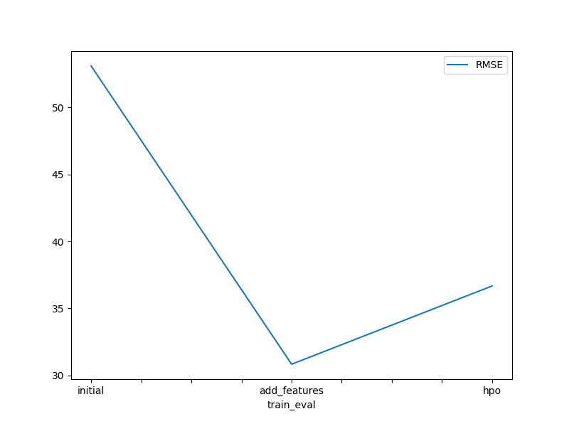
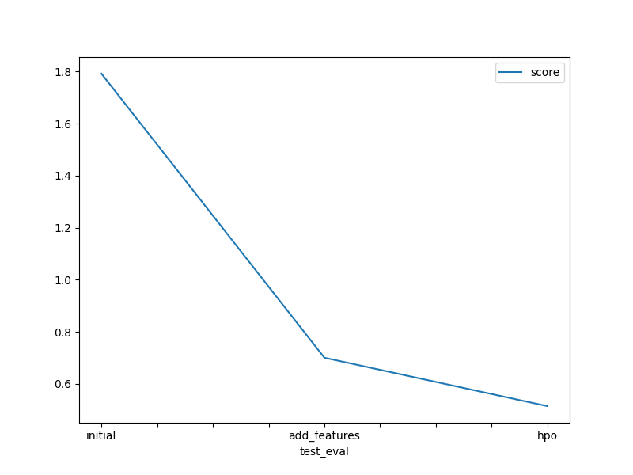

# Report: Predict Bike Sharing Demand with AutoGluon Solution
#### Xiaohu Zhang

## Initial Training
### What did you realize when you tried to submit your predictions? What changes were needed to the output of the predictor to submit your results?
I spent some time setting up my local environment. It turns out it is better to use conda to install autogluon. In addition, for the train and test data, I will need to remove the column named 'casual' and 'registered', and set 'count' as the target. Then I can use the data for training. I need to change the possible negative predictions to 0 in order to submit the results.

### What was the top ranked model that performed?
The best model is WeightedEnsemble_L3.

## Exploratory data analysis and feature creation
### What did the exploratory analysis find and how did you add additional features?
The following can be found using the exploratory analysis:
- People tend to ride the bike when the temperature is moderate, i.e., 20 - 30 celsius;
- People tend to ride the bike when there is not too much wind;
- People tend to rind the bike in Spring.

To add additional features, I extract the month, day and hour from the datetime.

### How much better did your model preform after adding additional features and why do you think that is?
The kaggle score, i.e., Root Mean Squared Logarithmic Error (RMSLE) has been creased by 60.92%, from 1.79207 to 0.70029. The reason is that the hour and day contribute a lot to how many people will ride the bike. 

## Hyper parameter tuning
### How much better did your model preform after trying different hyper parameters?
The kaggle score has been decreased to 0.51420 from 1.79207 in initial traing and 0.70029 in training with additional features.

### If you were given more time with this dataset, where do you think you would spend more time?
I will spend some time on feature engineering, and some time on hyperparameters tunning.

### Create a table with the models you ran, the hyperparameters modified, and the kaggle score.
|model|hpo1|hpo2|hpo3|score|
|--|--|--|--|--|
|initial|default|defalut|defalut|1.79207|
|add_features|default|default|default|0.70029|
|hpo|GBM:{'num_boost_round': 100, 'learning_rate: (0.01, 0.1)'}|NN:{'num_epochs': 10, 'learning_rate': (0.0001, 0.01)}|RF:{'n_estimators': (20, 40), 'max_features': ('sqrt', 'log2')}|0.51420|

### Create a line plot showing the top model score for the three (or more) training runs during the project.

TODO: Replace the image below with your own.

### Create a line plot showing the top kaggle score for the three (or more) prediction submissions during the project.

TODO: Replace the image below with your own.

## Summary
- Data exploratory is very important as it will provide some insights to the data, which will guide you to do some feature engineering;
- Creating additional feature can be very useful in improving the model performance;
- Hyperpameters tunning can also help improve the model performance;
- Autogluon is a powerful tool which allow you to test different model in just a few lines of code.
